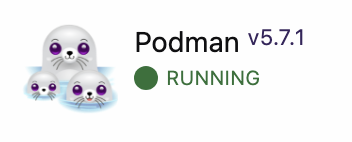

# Xsuite Container Repository

This repository provides Docker/Podman container definitions to create consistent tutorial environments for Jupyter notebooks used in xsuite workshops and tutorials.

**Purpose:** Provide a repeatable, cross-platform container that ships a conda-based `xsuite` environment and can be run interactively to host Jupyter Lab sessions for tutorials.

## Prerequisites
The only pre-requisite for this repository is a working installation of `podman` or `docker`. It is highly recommended to use `podman` to avoid potential permission issues, however the scripts in this repository have been tested and work with `docker` as well.

### Installing Podman

This is a quick guide for installing podman on different popular OSes. For a more detailed guide please consult the official podman installation instructions on https://podman.io/docs/installation. 

#### Linux (Ubuntu/WSL/Debian)
The most popular Linux distributions are debian-based, if you are unsure about your Linux distro, this command is the most likely to work on your system. In your terminal run the command:
```bash
sudo apt install -y podman
```

#### Linux (Fedora)
In your terminal run the command:
```bash
sudo dnf install -y podman
```

#### macOS
- Easiest (use UI):
	1. Open https://podman-desktop.io/ in your browser.
	2. Click the download link for macOS (Podman Desktop).
	3. Open the downloaded .dmg and drag the app to Applications.
	4. Open the app and accept any prompts. Use default settings.
- Command-line:

    If you want to install podman using homebrew you can use the following command.
    ```bash
    brew install --cask podman-desktop
    ```
    Note: This method is not officially supported by the podman developers.

#### Windows
- Easiest (use UI):
	1. Open https://podman-desktop.io/ in your browser.
	2. Click the Windows download link and run the installer.
	3. When the installer runs, accept the default options and click Next / Install.
	4. After install, launch "Podman Desktop" from the Start menu.
- Command-line (winget):
```powershell
winget install -e --id RedHat.Podman-Desktop
```

#### Quick tips (for absolute beginners)
- Use the graphical installer (UI) if you are unsure — it usually picks the right defaults.
- If a prompt asks to "allow" or "approve" anything during install, click the safe/allowed option and keep defaults.
- Restart your computer if the installer asks you to.

If you want help verifying Podman is installed, open a terminal (or PowerShell on Windows) and run:
```bash
podman --version
```
It should print a version number like "podman x.x.x". If you see that, you're done.

## Running Jupyter Notebooks
This repository provides scipts that significantly simplify the process of running the notebook environment for your machine regardless of operating system. 

### Before running
#### Linux
On Linux there are no pre-requisite steps required to run a podman container. You may proceed to the next section

#### macOS/Windows
On non-Linux operating systems, podman creates a Linux VM which runs the containers. As such, the only requirement is that the `podman machine` is running before executing the scripts. 

Ensure that you open the Podman Desktop app and from there go to Dashboard, scroll to the bottom and check that Podman shows as **Running**, as shown in the picture below. 



Another check that you can run is to run the command `podman ps` in your terminal and check that you get an output of the form:
```text
$ podman ps
CONTAINER ID  IMAGE       COMMAND     CREATED     STATUS      PORTS       NAMES
```
If you get an error instead, double-check that your podman machine is running from the UI, or open your terminal run:
```bash
podman machine start
``` 
Then try again.

### Run the notebook environment

#### Linux/macOS
On macOS and Linux, you can launch the notebook environment using the following command in your terminal:
```bash
./run_jupyter.sh PATH/TO/NOTEBOOKS
```
Where `PATH/TO/NOTEBOOKS` is a relative/absolute path to the folder containing all the relevant tutorial notebooks. This directory inside the notebook environment is mounted under `/workspace`.

Once the script is running you can access the jupyter lab instance on the address:

http://localhost:8888/lab?token=xsuite

If you run into permission issues, you might need to make the script executable by running:
```bash
chmod +x ./run_jupyter.sh
```
Then retry the previous command. 

**Advanced options:**
The script automatically selects the optimal parameteres for running the notebook environment. However, you can set the following environment variables while running this script:
- `ENGINE`: By setting this enviornment variable to `podman` or `docker` you can force the script to use your desired container engine.
- `PORT`: Select which port to forward to on localhost. Default is `8888`
- `JUPYTER_TOKEN`: The token for the jupyter server. By default it is `xsuite`, you can set a custom value or set to `auto` to let the jupyter server randomly generate one.

#### Windows

On Windows, use **PowerShell** (*not Command Prompt*) and run:
```powershell
.\run_jupyter.ps1 -NotebooksDir 'C:\PATH\TO\NOTEBOOKS'
```
Where `C:\PATH\TO\NOTEBOOKS` is an absolute path to the folder containing all the relevant tutorial notebooks. You can obtain that path by opening the folder containing the notebooks on File Explorer, clicking on the navigation bar and copying the directory. This directory inside the notebook environment is mounted under `/workspace`. It is possible that you will be asked whether you trust this script and you want it to run, select yes in all such prompts.

Once the script is running you can access the jupyter lab instance on the address:

http://localhost:8888/lab?token=xsuite

If PowerShell blocks the script with an "execution policy" error, run this instead to bypass for this run:
```powershell
powershell -ExecutionPolicy Bypass -File .\run_jupyter.ps1 -NotebooksDir 'C:\path\to\your\notebooks'
```
**Advanced options:**
The script automatically selects the optimal parameteres for running the notebook environment. However, you can set the following variables while running this script:
- `Engine`: By setting this enviornment variable to `podman` or `docker` you can force the script to use your desired container engine.
- `Port`: Select which port to forward to on localhost. Default is `8888`
- `JUPYTER_TOKEN`: The token for the jupyter server. By default it is `xsuite`, you can set a custom value or set to `auto` to let the jupyter server randomly generate one.

## Cleanup (Post-Tutorial and Optional)

After all tutorial sessions are over, you may want to remove the container from your disk to reduce disk usage. Please note that re-running the scripts will re-download the container if you have removed it. 

You can inspect how much disk space podman is using by running:
```bash
podman system df
```
You should see an output of the following type:
```text
$ podman system df
TYPE           TOTAL       ACTIVE      SIZE        RECLAIMABLE
Images         2           0           6.8GB       6.8GB (100%)
Containers     0           0           0B          0B (0%)
Local Volumes  0           0           0B          0B (0%)
```
You can try to clean it up using:
```bash
podman system prune
```
Then rerun the previous command to check the disk usage. If the disk space is still not being freed, you can use:
```bash
podman image ls
```
To inspect the images that you have downloaded locally, which should show an output like:
```text
$ podman image ls
REPOSITORY                           TAG         IMAGE ID      CREATED       SIZE
ghcr.io/ekatralis/xsuite-containers  latest      {hash}        x hours ago   1.62 GB
```
You can then manually remove the images to free disk space using:
```bash
podman rmi hash-of-image-you-want-to-remove
```

## Details for Developers/Notebook Creators
If you want more details on how to run the containers on different systems or about the container building process, consult the `DEV.md` file in this repository.